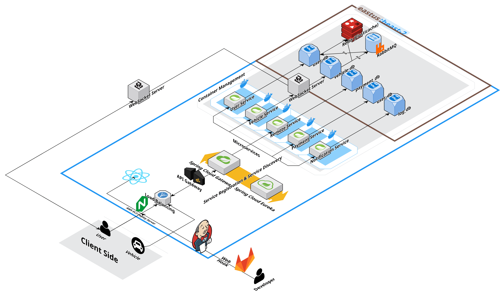

# 특화프로젝트 모빌리티 - 자율주행

## 소개

프로젝트의 목적과 배경, 그리고 해결하고자 하는 문제점을 간단히 서술합니다.

- **목적:**
    
    차량 제어와 자동 결제 시스템의 안정성과 독립성을 보장하는 백엔드 시스템 구축
    
- **배경:**
    
    MSA(마이크로서비스 아키텍처)를 통해 각 서비스의 독립적 실행과 관리, 장애 격리가 필수적이라는 요구 사항 도출
    

---

## 주요 기능

프로젝트의 핵심 기능들을 간략하게 나열합니다.

- **서비스 간 독립성 보장:** MSA 구조를 통한 개별 서비스 운영
- **자동 결제 시스템 지원:** 결제 서비스의 분리 배포 및 장애 최소화
- **비동기 통신 구현:** RabbitMQ 및 Redis Pub/Sub을 사용한 데이터 전달
- **API 게이트웨이:** 클라이언트 요청을 각 서비스로 라우팅하는 역할

---

## 시스템 아키텍처

---

## 기술 스택

### Frontend

- **React 18.2.0:** 최신 리액트 버전을 사용하여 UI 구성 및 상태관리를 수행합니다.
- **Three.js:** 3D 렌더링을 위한 라이브러리로, 인터랙티브한 3D 콘텐츠를 구현합니다.
- **JavaScript & HTML5:** 기본 웹 기술을 활용하여 사용자 인터페이스를 구축하며, 반응형 디자인 구현 및 웹 표준 준수.
- **Firebase Cloud Messaging (FCM):** 푸시 알림을 통해 사용자와 실시간 소통을 가능하게 합니다.

### Backend

- **Spring Boot 3.4.1:** 현대적인 백엔드 애플리케이션 프레임워크로, 빠른 개발 및 배포를 지원합니다.
- **Liberica Standard JDK 17.0.13+12 (x86 64 for Linux):** 최신 JDK 버전을 통해 안정적인 자바 기반 애플리케이션 실행 환경 제공.
- **Gradle:** 효율적인 빌드 및 의존성 관리를 위한 도구.
- **RabbitMQ:** 메시지 브로커로, 각 서비스간의 비동기 통신과 이벤트 기반 처리를 담당.
- **Spring Cloud Gateway:** API 게이트웨이 역할을 수행하며, 클라이언트 요청을 각 서비스로 라우팅.
- **Netflix Eureka:** 서비스 등록 및 검색을 담당하여 MSA 환경에서 서비스 디스커버리를 지원.
- **Spring Security & JWT:** 보안 인증 및 인가 처리를 위한 프레임워크와 토큰 기반 인증 방식 도입.
- **Feign Client:** 서비스 간의 간편한 REST API 호출을 위한 선언형 HTTP 클라이언트.
- **Spring Email:** 이메일 발송 기능을 통한 사용자 알림 및 비밀번호 복구 등의 시나리오 대응.
- **WebSocket:** 실시간 양방향 통신을 지원하여, 빠른 데이터 전송 및 이벤트 기반 처리 구현.

### Database

- **MySQL 8.0.40:** 관계형 데이터베이스 시스템으로, 안정적인 데이터 저장 및 관리.
- **Redis:** 인메모리 데이터베이스로 캐싱과 Pub/Sub 기능을 통해 빠른 데이터 처리 및 서비스 반응성 강화.
- **JPA/Hibernate:** ORM 프레임워크를 사용하여 객체와 관계형 데이터베이스 간의 매핑 및 관리.

### Infrastructure

- **AWS EC2:** 확장성과 유연성이 있는 클라우드 인프라로 서버를 운영.
- **Ubuntu 24.04 LTS:** 안정적인 운영 체제로, 서버 환경에 최적화되어 있음.
- **Docker:** 컨테이너 기반 배포를 통해 독립적이며 일관된 실행 환경 보장.
- **Nginx:** 웹 서버 및 리버스 프록시로, 정적 파일 서빙 및 부하 분산 역할 수행.
- **GitLab:** 소스 코드 관리 및 협업 플랫폼으로, GitOps 방식의 버전 관리 체계를 지원.
- **Jenkins:** CI/CD 도구로, 자동화된 빌드, 테스트, 배포 파이프라인을 구성하여 지속적인 통합 및 배포를 가능하게 함.

---

## 구성 요소

### 1. 회원 관리 서비스

**주요 기능 및 역할:**

- **회원 인증 및 로그인:**
    
    이메일 또는 카카오 로그인 요청을 받아 입력된 이메일/패스워드 또는 OAuth 토큰을 검증한 후, JWT 토큰(Access, Refresh)을 발급합니다.
    
- **회원가입 및 계정 관리:**
    
    신규 회원 가입 시 입력 정보의 형식과 중복 여부를 확인하고, DB에 회원 정보를 저장합니다. 이메일 중복 확인, 이메일 인증, 비밀번호 찾기, 아이디 조회 등 다양한 계정 관리 기능을 지원합니다.
    
- **프로필 조회 및 업데이트, 회원 탈퇴:**
    
    JWT 토큰을 통한 사용자의 신원 검증 후, 회원의 프로필 조회, 비밀번호 변경, 탈퇴(실제 삭제 대신 DB 상태 변경) 등 회원 관련 기능을 제공합니다.
    

**내부 처리 및 통신 방식:**

- **내부 API 호출 (동기 통신):**
    
    각 요청마다 Feign Client를 이용하여 내부 서비스 간 REST 호출을 진행하며, 응답 시간이 짧아 실시간 처리가 가능한 구조입니다.
    
- **메시지 기반 비동기 처리:**
    
    이메일 인증, 비밀번호 재설정 등 경우 일부 로직은 RabbitMQ나 Redis Pub/Sub을 활용하여 비동기 이벤트(예: 이메일 발송 요청)를 처리합니다.
    
- **보안 처리:**
    
    Spring Security와 JWT를 통해 모든 요청에 대해 인증 및 권한 검증을 수행하며, API 게이트웨이를 통해 전달받은 요청에 대한 추가 보안 검증도 진행합니다.
    

---

### 2. 차량 관리 서비스

**주요 기능 및 역할:**

- **차량 등록 및 정보 조회:**
    
    차량 등록 API를 통해 차량의 고유 정보(차대번호, 차종, 차량 이름 등)를 DB에 저장하고, 본인 및 타인의 차량 정보 조회 요청에 대해 검증 후 데이터를 반환합니다.
    
- **실시간 차량 위치 및 상태 정보:**
    
    ROS 노드와 연동하여 차량의 GPS(위치) 데이터를 수신하고, RabbitMQ를 통해 메시지 형태로 전달받은 최신 위치 정보를 Redis에 캐싱하여 웹소켓이나 API 호출 시 빠른 응답을 제공합니다.
    
- **주차 상태 변경:**
    
    차량 주차 여부를 변경하는 명령을 처리하며, 입력 데이터의 검증 후 DB 상의 차량 상태를 업데이트합니다.
    

**내부 처리 및 통신 방식:**

- **데이터 검증 및 DB 연동:**
    
    입력된 차량 데이터에 대한 형식과 중복 검사 후, DB(MySQL)에 저장합니다.
    
- **실시간 위치/상태 처리:**
    
    ROS 노드가 수신한 차량의 위치 및 상태 데이터는 RabbitMQ의 지정된 Exchange(예: ros_exchange)로 전송되고, 연동된 큐(vehicle.location.queue, vehicle.state.queue)를 통해 해당 데이터를 서비스에 전달합니다.
    
- **캐싱 및 Pub/Sub:**
    
    Redis를 활용하여 최신 GPS 데이터를 캐싱하고, 필요 시 Redis의 Pub/Sub 기능으로 실시간 업데이트를 제공하여 사용자에게 빠른 응답을 보장합니다.
    

---

### 3. 원격제어 서비스

**주요 기능 및 역할:**

- **원격 명령 처리:**
    
    차량 비상등 점멸, 주차 목적지 조회/설정, 원격 호출, 배회(로밍) 시작 및 중지 등의 원격 제어 명령을 처리합니다.
    
- **사용자 인증 및 권한 검증:**
    
    JWT 토큰을 통한 요청자 인증과, 해당 차량의 소유자 여부를 확인하여 명령이 올바른 사용자로부터 온 것임을 보장합니다.
    
- **비동기 메시지 처리:**
    
    원격 제어 명령(비상등, 주차/원격 호출 명령 등)은 RabbitMQ를 통해 각 차량에 발행되어, 차량 쪽에서는 해당 큐를 구독하여 명령을 실행하고 결과를 응답합니다.
    

**내부 처리 및 통신 방식:**

- **메시지 큐 기반 통신:**
    
    RabbitMQ를 활용해 명령 메시지를 생성하여 지정된 토픽 또는 큐에 발행하며, 이로 인해 각 차량은 명령을 비동기적으로 수신합니다.
    
- **실시간 응답 처리:**
    
    차량에서 명령 실행 후 결과를 다시 메시지 큐 또는 실시간 웹소켓 연결을 통해 받아 응답으로 전달합니다.
    
- **검증 및 오류 처리:**
    
    입력 데이터와 차량 식별 정보를 철저히 검증하며, 오류 발생 시 적절한 HTTP 상태 코드와 함께 실패 메시지를 반환합니다.
    

---

### 4. 결제 서비스

**주요 기능 및 역할:**

- **결제 내역 관리 및 처리:**
    
    사용자가 주차장을 선택하면 주차 요금(기본 요금, 단위 요금 등)을 초기 결제 내역에 등록하고, 입차 시각과 주차 종료 시 예상 결제 내역을 산출합니다.
    
- **외부 결제 시스템 연동:**
    
    아임포트(또는 유사한 외부 결제 API)와 통신하여 결제 건에 대한 검증, 승인, 취소 등의 작업을 수행하며, 결과에 따른 예외 처리를 수행합니다.
    
- **메시지 기반 이벤트 처리:**
    
    결제 완료나 취소와 같이 중요한 결제 이벤트는 RabbitMQ를 통한 메시지 발행으로 비동기적으로 후속 처리를 수행하여, 알림 서비스 등 다른 모듈과의 연계를 가능하게 합니다.
    

**내부 처리 및 분산 시스템 연동:**

- **API 게이트웨이 연동:**
    
    결제 요청은 Spring Cloud Gateway를 통해 수신되고, 이후 결제 서비스로 라우팅됩니다. 게이트웨이는 JWT 토큰 검증, CORS 설정, 로깅 및 오류 처리 등의 글로벌 기능을 제공하여 결제 요청의 안정성을 보장합니다.
    
- **Netflix Eureka 기반 서비스 디스커버리:**
    
    결제 서비스는 Eureka 서버에 등록되어 다른 내부 서비스(예: 회원 관리, 차량 관리, 알림 서비스)와 동적으로 통신할 수 있습니다. 서비스 인스턴스가 Eureka를 통해 자동 등록되며, 로드 밸런싱과 장애 복구 메커니즘이 적용되어 높은 가용성을 유지합니다.
    
- **비즈니스 로직 처리:**
    
    결제 내역 저장, 입/출차 시각 등록, 요금 산정 등의 로직이 실행됩니다. 데이터 검증, 트랜잭션 관리 및 외부 API 연동을 통해 결제 건의 신뢰성을 보장합니다.
    
- **메시지 큐 연동:**
    
    결제 관련 이벤트(완료, 취소 등)는 RabbitMQ를 통해 다른 서비스(예: 알림 서비스)로 전달되어, 결제 이벤트에 따른 후속 처리가 비동기적으로 이루어집니다.
    

---

### 5. 알림 서비스

**주요 기능 및 역할:**

- **FCM 토큰 관리:**
    
    사용자가 로그인 시 클라이언트로부터 전달받은 FCM 토큰을 등록하거나 갱신하여, 푸시 알림 발송을 위한 기초 데이터를 관리합니다.
    
- **푸시 알림 전송:**
    
    주차 완료, 결제 내역, 원격 제어 명령의 실행 결과 등 다양한 이벤트에 대해, 등록된 FCM 토큰을 기준으로 사용자에게 실시간 알림을 전송합니다.
    
- **내부 로깅 및 모니터링:**
    
    알림 발송 결과와 관련 로그를 기록하여 문제 발생 시 신속하게 대응할 수 있도록 합니다.
    

**내부 처리 및 통신 방식:**

- **통합된 인증 및 데이터 검증:**
    
    요청에 포함된 JWT 토큰을 검증한 후, 입력 데이터 형식(이메일, 차량 차대번호, 주차장 정보 등)과 유효성을 확인합니다.
    
- **메시지 기반 알림 전송:**
    
    RabbitMQ와 같은 메시지 큐 또는 직접 FCM API를 호출하는 방식으로, 알림 발송 명령을 처리합니다. 결제 완료나 주차 완료 이벤트의 경우, 이벤트 발생 후 해당 정보를 바탕으로 연결된 사용자의 모든 FCM 토큰에 알림을 전송합니다.
    
- **비동기 처리 및 재전송 로직:**
    
    알림 전송 실패 시 재시도 로직 또는 실패 결과를 로깅하여 사용자에게 반복적인 알림 전달 실패 없이 안정적인 알림 기능을 제공합니다.
    

---

## 전체 시스템 통신 방식 및 메시지 브로커 연동

**동기 통신:**

- **REST API 호출 (Feign Client 활용):**
    
    각 서비스는 API 게이트웨이를 통해 들어온 요청을 내부적으로 Feign Client를 통해 동기적으로 호출합니다. 이를 통해 호출 간의 응답 시간을 최소화하고, 서비스 간의 긴밀한 통합을 유지합니다.
    

**비동기 통신:**

- **RabbitMQ:**
    
    각 서비스는 중요한 이벤트나 원격 제어 명령, 결제, 차량 위치/상태 데이터 등 비동기 처리가 필요한 경우 RabbitMQ를 활용합니다.
    
    - **Exchange 및 큐 구성:**
        
        예를 들어, ROS 노드가 차량 위치 정보를 수신하면 지정된 fanout 타입의 Exchange(예: ros_exchange)를 통해 메시지가 vehicle.location.queue 혹은 vehicle.state.queue와 같은 큐로 분배됩니다.
        
    - **이벤트 발행 및 처리:**
        
        결제 이벤트, 원격 제어 명령, 알림 전송 등은 RabbitMQ에 메시지를 발행하여 각 관련 서비스(알림, 결제, 차량 관리)에서 구독 후 비동기적으로 처리합니다.
        
- **Redis Pub/Sub:**
    
    실시간 업데이트가 필요한 경우, 예를 들어 차량의 실시간 GPS 위치 데이터는 Redis의 Pub/Sub 기능을 활용하여 빠르게 캐싱 및 브로드캐스트됩니다.
    
    - **실시간 캐싱:**
        
        최신 위치 정보는 Redis에 캐싱되어 API 호출이나 웹소켓을 통한 실시간 응답에 활용됩니다.
        

**API 게이트웨이 및 서비스 디스커버리:**

- **Spring Cloud Gateway:**
    
    클라이언트의 모든 요청은 API 게이트웨이를 통해 수신되며, 보안(인증, CORS), 로드 밸런싱, 장애 격리 등의 역할을 수행합니다.
    
- **Netflix Eureka:**
    
    각 서비스는 Eureka에 등록되어 동적으로 검색 및 호출됩니다. 서비스의 상태를 모니터링하여 장애 발생 시 자동으로 다른 인스턴스로 요청이 전달되는 구조를 갖추고 있습니다.
    

---

## API 문서

<table>
  <thead>
    <tr>
      <th>도메인</th>
      <th>기능</th>
      <th>BACKEND</th>
      <th>FRONTEND</th>
      <th>유형</th>
      <th>URL</th>
      <th>설명</th>
      <th>우선 순위</th>
      <th>담당자</th>
    </tr>
  </thead>
  <tbody>
    <tr>
      <td>회원 관리</td>
      <td>회원 로그인</td>
      <td>개발 완료</td>
      <td>개발 완료</td>
      <td>POST</td>
      <td>api/v1/auth/login</td>
      <td>
        • 이메일 로그인: 
        &nbsp;&nbsp;&nbsp;◦ 요청받은 이메일과 패스워드를 검증한다. 
        &nbsp;&nbsp;&nbsp;◦ 인증 성공 시, 해당 유저 정보를 포함하고 만료 시간, 권한 등의 보안 요소를 갖춘 JWT 토큰을 생성한다. 
        • 카카오 로그인: 
        &nbsp;&nbsp;&nbsp;◦ 요청받은 카카오 OAuth 액세스 토큰의 유효성을 확인한다. 
        &nbsp;&nbsp;&nbsp;◦ 회원가입 여부를 체크하여, 이미 가입된 경우 유저 정보를 기반으로 JWT 토큰을 생성한다. 
        &nbsp;&nbsp;&nbsp;◦ 미가입인 경우, 회원가입 페이지로 리다이렉션할 URL을 응답에 포함한다.
      </td>
      <td>중</td>
      <td>이석현</td>
    </tr>
    <tr>
      <td>회원 관리</td>
      <td>회원가입</td>
      <td>개발 완료</td>
      <td>개발 완료</td>
      <td>POST</td>
      <td>api/v1/auth/signup</td>
      <td>
        • 이메일 회원가입: 
        &nbsp;&nbsp;&nbsp;◦ 입력받은 모든 필드(이름, 성별, 생년월일, 이메일, 비밀번호, 휴대전화 번호)에 대해 형식 및 유효성 검사를 수행. 
        &nbsp;&nbsp;&nbsp;◦ 이메일 중복 가입 여부 확인 후, 신규 사용자 정보를 DB에 저장. 
        • 카카오 회원가입: 
        &nbsp;&nbsp;&nbsp;◦ 카카오 OAuth 인증 진행 및 전달받은 인증 정보를 기반으로 회원가입 여부를 확인한다. 
        &nbsp;&nbsp;&nbsp;◦ 미가입 시 추가 정보(additionalData)로 입력받은 정보를 DB에 저장한다.
      </td>
      <td>중</td>
      <td>이석현</td>
    </tr>
    <tr>
      <td>회원 관리</td>
      <td>로그아웃</td>
      <td>개발 완료</td>
      <td>개발 완료</td>
      <td>POST</td>
      <td>/api/v1/auth/logout</td>
      <td>
        JWT 토큰 기반 인증 방식에서 로그아웃은 클라이언트가 보유한 토큰을 삭제하는 방식으로 처리된다. 
        • 서버는 전달받은 JWT 토큰의 유효성을 확인하고, 토큰 무효화(리프레시 토큰 삭제)를 수행한 후 로그아웃 완료 메시지를 반환한다.
      </td>
      <td>중</td>
      <td>이석현</td>
    </tr>
    <tr>
      <td>회원 관리</td>
      <td>이메일 인증 요청</td>
      <td>개발 완료</td>
      <td>개발 완료</td>
      <td>POST</td>
      <td>/api/v1/auth/verify-email</td>
      <td>-</td>
      <td>중</td>
      <td>이석현</td>
    </tr>
    <tr>
      <td>회원 관리</td>
      <td>이메일 인증 코드 검증</td>
      <td>개발 완료</td>
      <td>개발 완료</td>
      <td>POST</td>
      <td>/api/v1/auth/verify-code</td>
      <td>-</td>
      <td>중</td>
      <td>이석현</td>
    </tr>
    <tr>
      <td>회원 관리</td>
      <td>비밀번호 찾기</td>
      <td>개발 완료</td>
      <td>개발 완료</td>
      <td>POST</td>
      <td>/api/v1/auth/retrieve-password</td>
      <td>
        사용자가 이름과 휴대전화 번호를 입력하면, 회원 아이디를 Spring Email로 등록된 이메일 주소로 전송한다. 
        성공 시 "회원 아이디가 등록된 이메일로 발송되었습니다." 메시지를 반환.
      </td>
      <td>중</td>
      <td>이석현</td>
    </tr>
    <tr>
      <td>회원 관리</td>
      <td>아이디 찾기</td>
      <td>취소</td>
      <td>취소</td>
      <td>POST</td>
      <td>/api/v1/members/find-id</td>
      <td>
        사용자가 이름과 휴대전화 번호를 입력하면, 회원 아이디를 Spring Email로 전송한다. 
        성공 시 "회원 아이디가 등록된 이메일로 발송되었습니다." 메시지를 반환.
      </td>
      <td>중</td>
      <td>이석현</td>
    </tr>
    <tr>
      <td>회원 관리</td>
      <td>회원 탈퇴</td>
      <td>개발 완료</td>
      <td>개발 완료</td>
      <td>POST</td>
      <td>/api/v1/members/withdraw</td>
      <td>
        실제 데이터는 삭제하지 않고 계정 상태를 '비활성화'로 업데이트한다. 
        클라이언트는 JWT 토큰과 탈퇴 확인용 패스워드를 전송하며, 서버는 이를 확인 후 탈퇴 처리를 완료한다.
      </td>
      <td>중</td>
      <td>이석현</td>
    </tr>
    <tr>
      <td>회원 관리</td>
      <td>회원 정보 조회</td>
      <td>개발 완료</td>
      <td>개발 완료</td>
      <td>GET</td>
      <td>/api/v1/members/profile</td>
      <td>
        클라이언트가 JWT 토큰을 통해 신원을 확인한 후, DB에서 프로필 정보를 조회하여 반환한다.
      </td>
      <td>중</td>
      <td>이석현</td>
    </tr>
    <tr>
      <td>회원 관리</td>
      <td>비밀번호 변경</td>
      <td>개발 완료</td>
      <td>개발 완료</td>
      <td>POST</td>
      <td>/api/v1/members/change-password</td>
      <td>
        JWT 토큰을 통해 사용자를 인증하고, 입력된 새로운 정보에 대해 검증 후 회원 정보를 업데이트한다. 
        성공 시 수정된 정보를 반환, 오류 발생 시 적절한 메시지 전달.
      </td>
      <td>중</td>
      <td>이석현</td>
    </tr>
    <tr>
      <td>회원 관리</td>
      <td>이메일 중복 확인</td>
      <td>개발 완료</td>
      <td>개발 완료</td>
      <td>POST</td>
      <td>/api/v1/auth/check-email</td>
      <td>
        신규 회원 가입 전에 이메일 중복 여부를 확인하여 중복 가입을 방지한다.
      </td>
      <td>중</td>
      <td>이석현</td>
    </tr>
    <tr>
      <td>차량 관리</td>
      <td>차량 등록</td>
      <td>개발 완료</td>
      <td>개발 완료</td>
      <td>POST</td>
      <td>/api/v1/vehicles/register</td>
      <td>
        시뮬레이션 환경에서 차량 등록 기능을 구현한다. 
        클라이언트는 JWT, 차량 차대번호, 차종, 이름, (옵션) 요금제 정보를 전송하며, 서버는 이를 검증 후 DB에 저장한다.
      </td>
      <td>중</td>
      <td>이석현</td>
    </tr>
    <tr>
      <td>차량 관리</td>
      <td>본인 소유 차량 정보 조회</td>
      <td>개발 완료</td>
      <td>개발 완료</td>
      <td>GET</td>
      <td>/api/v1/vehicles/my</td>
      <td>
        JWT 토큰을 통해 사용자를 인증한 후, 쿼리 파라미터의 차종/차대번호 정보를 바탕으로 차량 정보를 조회한다. 
        조회 결과가 있으면 성공 메시지와 함께 반환한다.
      </td>
      <td>중</td>
      <td>이석현</td>
    </tr>
    <tr>
      <td>차량 관리</td>
      <td>본인 외 소유 차량 정보</td>
      <td>취소</td>
      <td>취소</td>
      <td>GET</td>
      <td>/api/v1/vehicles/others</td>
      <td>
        인증 정보를 바탕으로, 쿼리 파라미터의 차량 내부 모뎀 및 차대번호 정보를 이용해 차량 정보를 조회한다. 
        소유자와 다른 차량 정보가 반환된다.
      </td>
      <td>하</td>
      <td>이석현</td>
    </tr>
    <tr>
      <td>차량 관리</td>
      <td>차량 현재 위치 조회</td>
      <td>개발 완료</td>
      <td>개발 완료</td>
      <td>GET</td>
      <td>/api/v1/vehicles/location</td>
      <td>
        JWT 토큰 인증 후, 쿼리 파라미터의 차량 차대번호(vehicleVin)를 기준으로 현재 위치(GPS)를 조회한다. 
        위치 데이터는 레디스에 저장되며, 웹소켓을 통해 실시간 업데이트된다.
      </td>
      <td>상</td>
      <td>이석현</td>
    </tr>
    <tr>
      <td>차량 관리</td>
      <td>차량 상태 정보 조회</td>
      <td>개발 완료</td>
      <td>개발 완료</td>
      <td>POST</td>
      <td>/api/v1/vehicles/status</td>
      <td>
        - 차량 주차 여부 (완료) 
        - 차량 현재 속도 (완료) 
        - 현재 위치에서 주차장까지의 거리 
        - 현재 위치에서 나와의 거리
      </td>
      <td>상</td>
      <td>이석현</td>
    </tr>
    <tr>
      <td>차량 관리</td>
      <td>차량 주차 상태 변경</td>
      <td>개발 완료</td>
      <td>해당 없음</td>
      <td>POST</td>
      <td>/api/v1/vehicles/parking-state</td>
      <td>-</td>
      <td>상</td>
      <td>이석현</td>
    </tr>
    <tr>
      <td>원격제어</td>
      <td>차량 비상등 점멸</td>
      <td>취소</td>
      <td>해당 없음</td>
      <td>POST</td>
      <td>/api/v1/remote/vehicle/hazard</td>
      <td>
        등록된 차량에 대해 원격으로 비상등 점멸 명령을 실행한다. 
        • 입력: JWT 토큰으로 인증 후, 차량 차대번호 전송 
        • 로직: 차량 소유 여부 확인 및 메시지 큐를 통해 명령 발행 
        • 출력: 실행 결과 또는 오류 메시지 반환
      </td>
      <td>하</td>
      <td>이석현</td>
    </tr>
    <tr>
      <td>원격제어</td>
      <td>주차 목적지 조회</td>
      <td>개발 완료</td>
      <td>개발 완료</td>
      <td>POST</td>
      <td>/api/v1/remote/parking/destination</td>
      <td>-</td>
      <td>상</td>
      <td>이석현</td>
    </tr>
    <tr>
      <td>원격제어</td>
      <td>주차 목적지 설정</td>
      <td>개발 완료</td>
      <td>개발 완료</td>
      <td>POST</td>
      <td>/api/v1/remote/parking/choose</td>
      <td>-</td>
      <td>상</td>
      <td>이석현</td>
    </tr>
    <tr>
      <td>원격제어</td>
      <td>원격 호출 목적지 설정</td>
      <td>개발 완료</td>
      <td>개발 완료</td>
      <td>POST</td>
      <td>/api/v1/remote/destination</td>
      <td>
        웹앱에서 현재 위치 정보를 기반으로 차량에 원격 호출을 하여 요청 시각에 맞춰 도착하도록 설정한다. 
        • 입력: Geolocation API로 수집한 현재 위치(위도, 경도)와 선택적 요청 시각 
        • 로직: JWT 인증 후, 위치 정보 검증 및 메시지 큐에 메시지 발행 
        • 출력: 차량의 최신 위치 정보 반환
      </td>
      <td>상</td>
      <td>이석현</td>
    </tr>
    <tr>
      <td>원격제어</td>
      <td>배회 요청(차량 인포테인먼트)</td>
      <td>개발 완료</td>
      <td>개발 완료</td>
      <td>POST</td>
      <td>/api/v1/remote/roam</td>
      <td>
        차량 인포테인먼트 시스템이 스스로 배회 요청을 보낼 수 있도록 한다. 
        • 입력: 차대번호 및 현재 위치(위도, 경도)와 선택적 배회 시간/범위 
        • 로직: 차량 식별 및 메시지 큐를 통한 배회 요청 발행 
        • 출력: 계산된 배회 경로와 성공 여부 반환
      </td>
      <td>상</td>
      <td>이석현</td>
    </tr>
    <tr>
      <td>원격제어</td>
      <td>배회 중지</td>
      <td>개발 완료</td>
      <td>수정 필요</td>
      <td>POST</td>
      <td>/api/v1/remote/roam/stop</td>
      <td>-</td>
      <td>-</td>
      <td>-</td>
    </tr>
    <tr>
      <td>원격제어</td>
      <td>배회 중지 및 주차 요청</td>
      <td>개발 완료</td>
      <td>수정 필요</td>
      <td>POST</td>
      <td>/api/v1/remote/roam/stop-parking</td>
      <td>-</td>
      <td>-</td>
      <td>-</td>
    </tr>
    <tr>
      <td>결제</td>
      <td>초기 결제 내역 등록</td>
      <td>개발 완료</td>
      <td>개발 완료</td>
      <td>POST</td>
      <td>/api/v1/payments/register/init-history</td>
      <td>-</td>
      <td>상</td>
      <td>김태민</td>
    </tr>
    <tr>
      <td>결제</td>
      <td>입차 시각 등록</td>
      <td>개발 완료</td>
      <td>해당 없음</td>
      <td>POST</td>
      <td>/internal/parking-start</td>
      <td>-</td>
      <td>-</td>
      <td>김태민</td>
    </tr>
    <tr>
      <td>결제</td>
      <td>예상 결제 내역</td>
      <td>개발 완료</td>
      <td>개발 완료</td>
      <td>POST</td>
      <td>/api/v1/payments/complete</td>
      <td>-</td>
      <td>-</td>
      <td>김태민</td>
    </tr>
    <tr>
      <td>결제</td>
      <td>결제 검증</td>
      <td>개발 완료</td>
      <td>개발 완료</td>
      <td>POST</td>
      <td>/api/v1/payments/{imp_uid}</td>
      <td>-</td>
      <td>-</td>
      <td>김태민</td>
    </tr>
    <tr>
      <td>결제</td>
      <td>결제 취소</td>
      <td>개발 완료</td>
      <td>개발 완료</td>
      <td>POST</td>
      <td>/api/v1/payments/cancel/{imp_uid}</td>
      <td>-</td>
      <td>-</td>
      <td>김태민</td>
    </tr>
    <tr>
      <td>알림</td>
      <td>FCM 토큰 발급</td>
      <td>개발 완료</td>
      <td>개발 완료</td>
      <td>POST</td>
      <td>/api/v1/notifications/fcm-token</td>
      <td>
        사용자가 로그인할 때 푸쉬 알림 전송 및 PWA 지원을 위해 발급받은 FCM 토큰을 등록(또는 재발급)한다. 
        • 입력: 로그인 후 FCM 토큰 전송 
        • 로직: JWT 인증 후 fcm_tokens 테이블에 저장/업데이트 
        • 출력: 성공 메시지 반환
      </td>
      <td>상</td>
      <td>이석현</td>
    </tr>
    <tr>
      <td>알림</td>
      <td>주차 완료 알림</td>
      <td>개발 완료</td>
      <td>해당 없음</td>
      <td>POST</td>
      <td>/api/v1/notifications/parking-complete</td>
      <td>
        차량 또는 ROS 측에서 주차 완료 시, 주차 관련 데이터를 전달하면 소유주에게 주차 완료 알림(FCM) 전송한다. 
        • 입력: 주차 관련 정보 전송 
        • 로직: DB에서 소유주의 모든 FCM 토큰 조회 후 메시지 발송 
        • 출력: 전송 결과 반환
      </td>
      <td>중</td>
      <td>이석현</td>
    </tr>
    <tr>
      <td>알림</td>
      <td>결제 알림</td>
      <td>개발 완료</td>
      <td>개발 완료</td>
      <td>POST</td>
      <td>/api/v1/notifications/payment</td>
      <td>
        주차장 결제 시 차량이 결제 내역을 전달하면, 소유주에게 결제 내역을 포함한 푸쉬 알림 전송한다. 
        • 입력: 차대번호 및 결제 내역 정보 전송 
        • 로직: 해당 소유주 FCM 토큰 조회 후 메시지 발송 
        • 출력: HTTP 상태 코드로 결과 확인
      </td>
      <td>중</td>
      <td>이석현</td>
    </tr>
  </tbody>
</table>

---

## 배포 전략

- **컨테이너 기반 배포:**
    
    Docker와 Docker Compose(또는 Kubernetes)를 이용한 배포 방법 설명
    
- **CI/CD 파이프라인:**
    
    GitHub Actions, Jenkins 등을 통해 자동화된 빌드 및 배포 과정 설명
    
- **버전 관리 및 롤백:**
    
    서비스 버전 관리 전략, 롤백 방법 등 기술
    

*참고: 배포 다이어그램이나 배포 파이프라인 흐름도를 첨부하는 것도 유용합니다.*

---

## 기타 자료

- **설계 문서 및 아키텍처 자료:**
    
    관련 PPT, PDF 파일, 혹은 외부 링크
    
- **참고 자료:**
    
    블로그, 공식 문서, 기술 세미나 자료 등
    

*예: 프로젝트 개발 시 참고한 자료의 링크를 나열하거나, 다이어그램/프로세스 그림 파일을 첨부합니다.*

---

## 라이선스

프로젝트의 라이선스 정보를 명시합니다.

예시: MIT License
